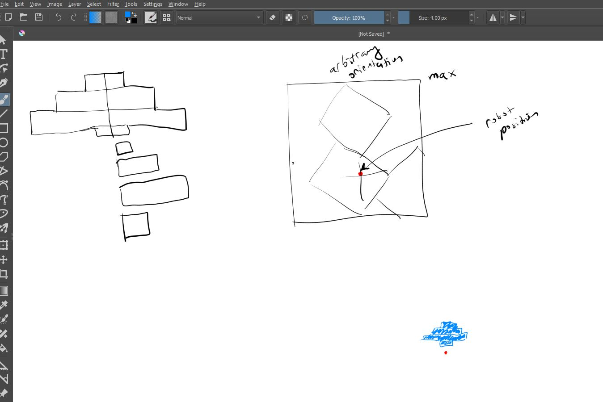

### 01/29/2025

6:44 PM

I did a 5K run I feel like I have energy right now let's see

- plot square
- rotate coordinates 90 degrees and plot

6:50 PM
I'm gonna start working on cameras again, I want to make a new UI

### 01/28/2025

8:03 PM

poor ass reporting for duty

gonna try and feel like I achieved something, I donated plasma today so there is this gauze thing around my elbow annoying to type with

I did eat more and drink less caffeine I feel less miserable today headache wise

8:07 PM

I've got a movie on in the background, not smart

8:17 PM

gonna pause this movie

8:31 PM

I need a way to plot these scan planes at any angle/orientation

I should use the ploting library to see the stuff too that would help

8:33 PM

Okay yeah that could be a quick goal, plot a square in mat plot lib

this is great
https://stackoverflow.com/questions/13013781/how-to-draw-a-rectangle-over-a-specific-region-in-a-matplotlib-graph

pretty much what will happen is the scan, plot full open space or partial, move forward (IMU) do i again, if turning track that

8:38 PM

I have to get the min/max values per sensor scan too

8:42 PM

I'm struggling... I'm fat as shit too damn, like I lift and have muscles but my gut, sucks sitting on your as 90%

I do a non-stop 5K run but it's only 1 day 

Yeah... I just feel shitty damn

8:48 PM

Let me try and get those min max values just screwing around with a fiddle

This stuff is not hard I'm just drained after my 8 hr desk job... I'm not sure if it's the salt but I had a nightmare too so woke up like 2.5 hrs into sleep, slept the rest of the 4 hrs till getting up at 7:30 AM

8:50 PM

fuhhhhh I failed I'll just do nothing I guess

8:54 PM

This is what I've had in a sketch program for a bit

8:59 PM

Yeah I think I just gotta accept that I can't code (more) after work

### 01/27/2025

6:45 PM

I usually write into one of these things as I work on stuff but this project (branch) I've been making videos of the process.

Anyway I'm feeling drained again, slept like 6 hrs and then did my 8hr shift of software type work.

I'm not sure what it is, diet... I work out everyday (it's not a hard workout mostly lifting) it may be my diet (mostly protein and caffeine).

But anyway it is a struggle for me to have motivation after work to do stuff/have energy after work despite not being labor.

What I wanted to do right now is to plot the mesh parts in python (no visual) just purely coordinate math.

I can double check it via SketchUp or even ThreeJS plotting but I'm talking about generating a map/collision detection in 2D.
