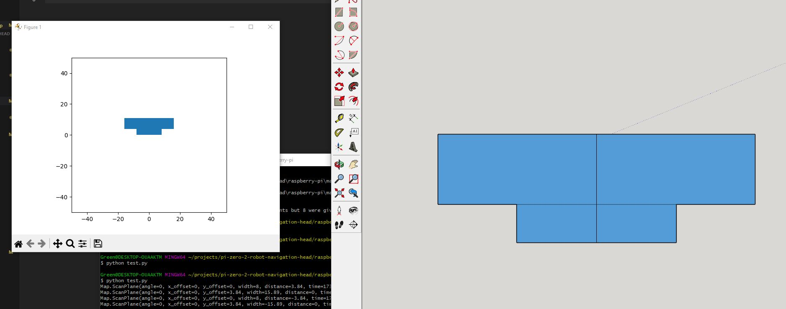
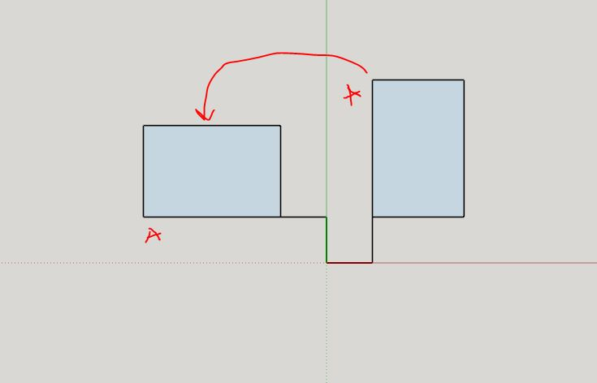
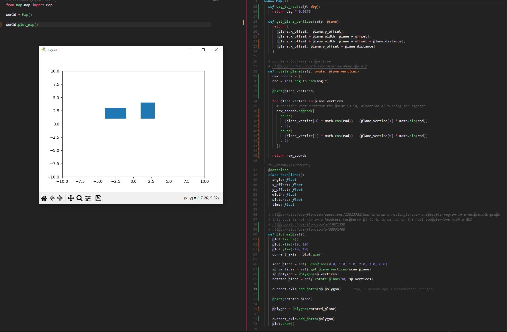
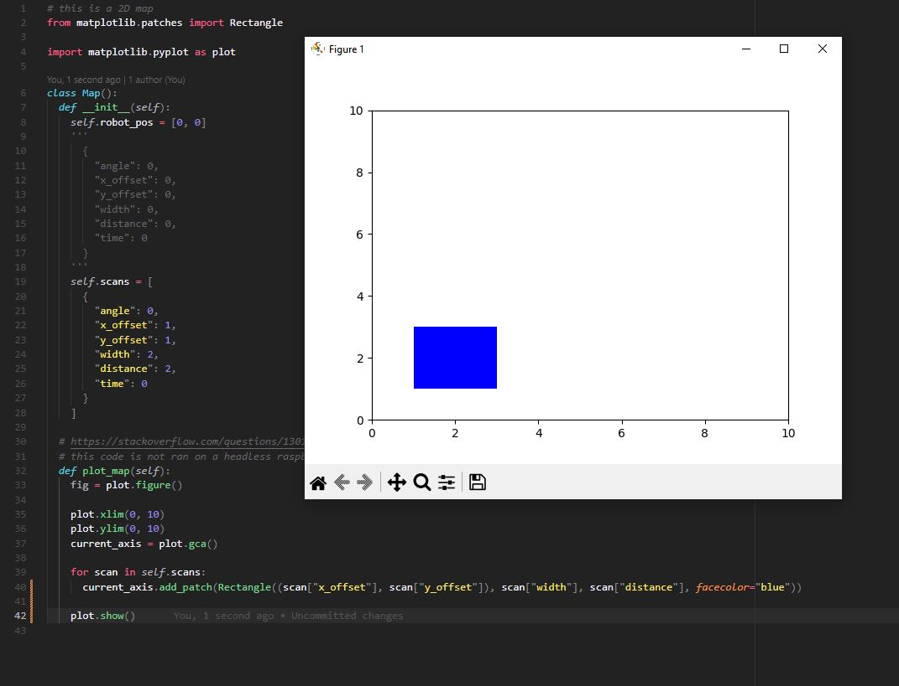
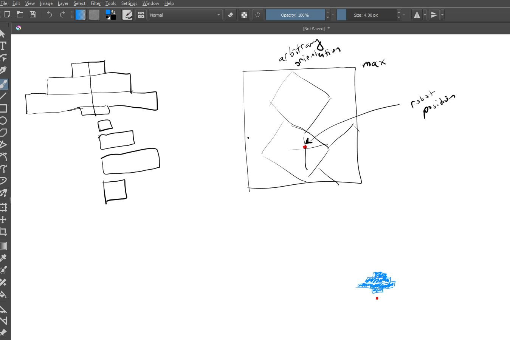

### 02/02/2025

10:22 AM

Alright back on, I wish I could say I slept well but I did not

But I have the whole day to build a basic 2D mapping system

These are the tasks right away I can think of:

- [ ] get min/max scan values from full floor scan
- [ ] plot full scan in 2D
- [ ] track IMU while moving forward, verify how close or assume motion was complete
- [ ] build basic wall map from the scans
- [ ] add telemetry to ThreeJS socket eg. "performing scan, moving, etc..."

I think that's a good start, ideally you would have a 2D wireframe map where you can drop points for the robot to go to

10:42 AM

I'm distracted, got my coffee let's go

I wish I didn't drop this robot head before, the battery holder snapped off so it's just hanging/rubs against the sides of the gimbal mount thing

It's too much work to rebuild it, it was a PITA to solder all the parst together and keep the wires short

To be one with the Kornholio one must engage the Kornholio (my Korn focus playlist)

11:17 AM

Yeah so both my wooden floor data has over 300 on the far scans (bounced off into infinity), I'll use the carpet scans then for max values

https://jsfiddle.net/eh47y368/

That's the min max error check code

I'll use the resulting values as caps/checks for flat scans to determine if there's an object there

11:22 AM

break

11:58 AM

The error rate with the wood values is too high

I either drop that data set or just stick with the first two scans

I think I should keep it and just stick with the two scan levels, that'll save scan time too

https://jsfiddle.net/eh47y368/3/

This means the farthest the robot can go at a time is 10.87" pretty weak

With vision it could be better, I actually want to map the pixels to depth even if the data is bad (not a lot of distance point clouds)

This is where visual inertial odometry comes in too but that's advanced for me

Alright time to plot

12:20 PM

I feel so stupid lol how I struggle with this but here it is, plotted a full scan plane for 54 and 35 degrees tilt

### 02/01/2025

7:43 PM

Today was kind of a wasted day I had to run a bunch of errands so lost most of the day doing that crap like waiting for 1.5 hrs to get my oil changed.

You know... cuz I like to drive but I don't like working on my car

I will setup the scan plotting at least but I am mentally spent/been binge eating, I think I'll just enjoy this day of the weekend (Saturday)

8:15 PM

I'm side tracked, probably just gonna commit to not doing anything

### 01/30/2025

7:18 PM

I got a couple beers in me... let's try to make this happen

Gonna rotate a plane baby, back to 5th grade

7:24 PM

Here we've got the plane but rotated, using SketchUp to know what it should look like

7:29 PM

Damn it stop looking at social media

I stopped looking at 1, but I still have 2 more (img sharing site and YouTube)

Can't always be grinding for sure

7:30 PM

This is tricky because the X,Y offset/coordinate is based on the robot's trajectory via the IMU displacement

8:33 PM

It's off

I guess the math is right but the plot window changes the aspect ratio of the plot

Wow this is weird... my eyes tell me they're not equal but if you use MS Paint and crop the vertical rectangle and rotate it left 90 deg it's the same area... that's tripp

Will need to test this more but I at least have the basis of being able to plot scan planes and rotating/translating them as the robot moves

9:02 PM

It's coming to me now, I realized I can do what a simulation is ha... plot and animate over time as if the robot (square) was actually moving

I am going to drive less (UE) so I have more time to work on projects

---

### 01/29/2025

6:44 PM

I did a 5K run I feel like I have energy right now let's see

- plot square
- rotate coordinates 90 degrees and plot

6:50 PM
I'm gonna start working on cameras again, I want to make a new UI

7:20 PM

Damn I got distracted, I'm looking to buy another c-mount lens lol the 2.8-12mm one in particular that'd be a nice zoom lens between 15mm to 66mm roughly full frame

Aside from that I want to get a full frame adapter and try out random manual lenses and... build a new auto zoom f-stop thing that's cleaner than the ML-hatcam. I'm looking forward to this coming summer if my life stays on the trajectory it's going right now financially

7:31 PM

ehh... I don't think it's worth it, the lens appears to have a 3MP resolving power... should just go for the adapter

I'm curious why there's no sample images out there though I may get it just for that

7:35 PM
Oh yeah I am trying to do this plot just ran into an admin issue with pip on windows

7:38 PM

Aye there we go... I think I'll use classes for the scan planes because I can use dot notation/looks prettier

8:15 PM

Alright before I start watching tv/eating food, let me do a rotation real quick, let me make sure it's asymmetric not a square

---

### 01/28/2025

8:03 PM

poor ass reporting for duty

gonna try and feel like I achieved something, I donated plasma today so there is this gauze thing around my elbow annoying to type with

I did eat more and drink less caffeine I feel less miserable today headache wise

8:07 PM

I've got a movie on in the background, not smart

8:17 PM

gonna pause this movie

8:31 PM

I need a way to plot these scan planes at any angle/orientation

I should use the ploting library to see the stuff too that would help

8:33 PM

Okay yeah that could be a quick goal, plot a square in mat plot lib

this is great
https://stackoverflow.com/questions/13013781/how-to-draw-a-rectangle-over-a-specific-region-in-a-matplotlib-graph

pretty much what will happen is the scan, plot full open space or partial, move forward (IMU) do i again, if turning track that

8:38 PM

I have to get the min/max values per sensor scan too

8:42 PM

I'm struggling... I'm fat as shit too damn, like I lift and have muscles but my gut, sucks sitting on your as 90%

I do a non-stop 5K run but it's only 1 day 

Yeah... I just feel shitty damn

8:48 PM

Let me try and get those min max values just screwing around with a fiddle

This stuff is not hard I'm just drained after my 8 hr desk job... I'm not sure if it's the salt but I had a nightmare too so woke up like 2.5 hrs into sleep, slept the rest of the 4 hrs till getting up at 7:30 AM

8:50 PM

fuhhhhh I failed I'll just do nothing I guess

8:54 PM

This is what I've had in a sketch program for a bit

8:59 PM

Yeah I think I just gotta accept that I can't code (more) after work

---

### 01/27/2025

6:45 PM

I usually write into one of these things as I work on stuff but this project (branch) I've been making videos of the process.

Anyway I'm feeling drained again, slept like 6 hrs and then did my 8hr shift of software type work.

I'm not sure what it is, diet... I work out everyday (it's not a hard workout mostly lifting) it may be my diet (mostly protein and caffeine).

But anyway it is a struggle for me to have motivation after work to do stuff/have energy after work despite not being labor.

What I wanted to do right now is to plot the mesh parts in python (no visual) just purely coordinate math.

I can double check it via SketchUp or even ThreeJS plotting but I'm talking about generating a map/collision detection in 2D.
