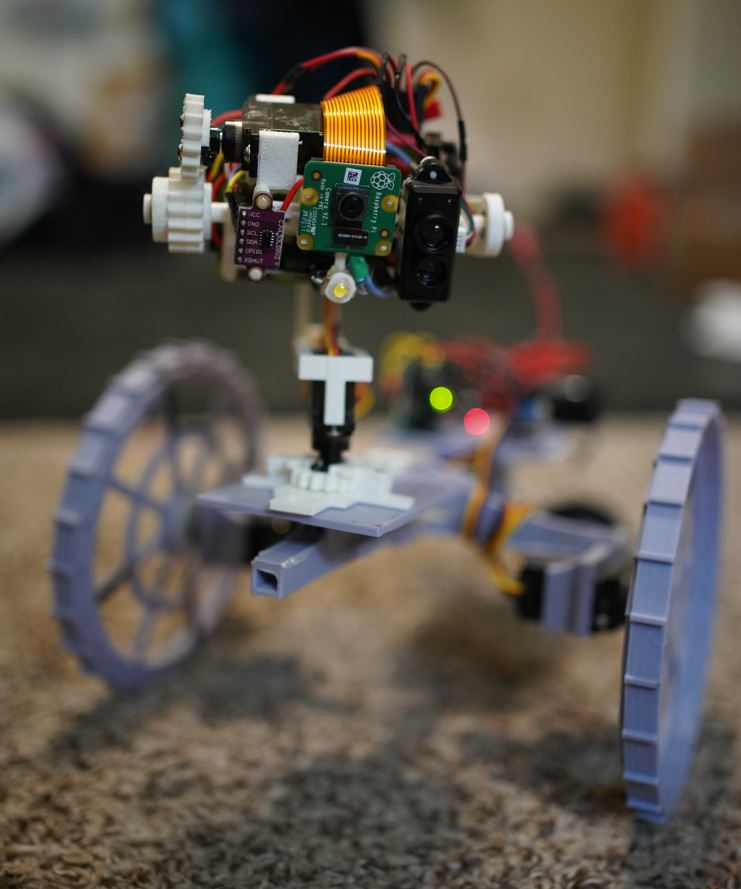
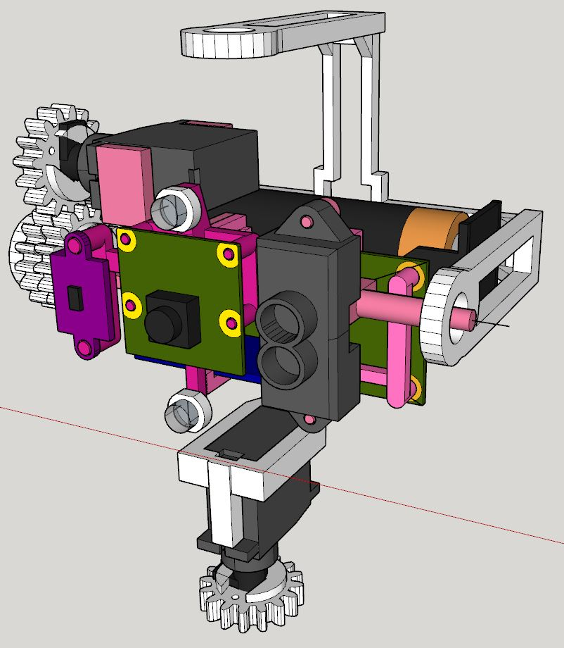
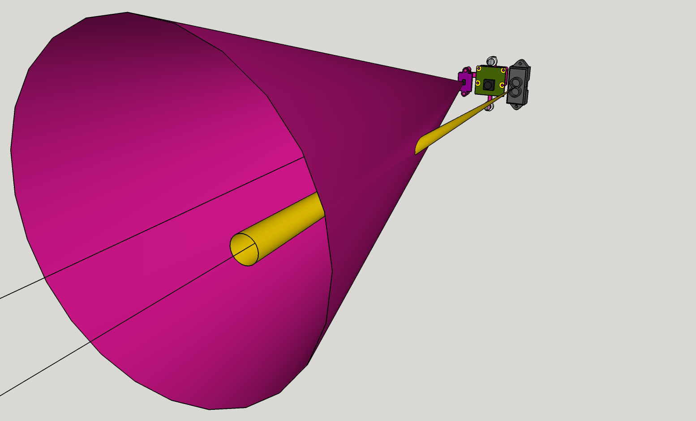
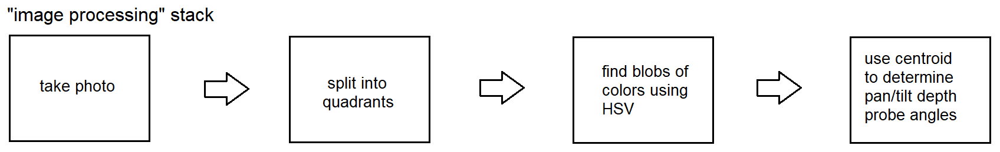

### About

Also known as **UwU NavU** (navigation unit)

### Actual

### Design

### Two different beam FOVs

### Navigation method

Then onboard IMU estimates distance traveled/keeps 3D representation of world [0] in memory (future, show in web browser)

[0] world represented as cubes based on blob/probe

### Sensors:

* camera
* VL530X ToF close range wide FOV
* TFmini-s lidar long range small FOV
* MPU 6050

On a two servo pan-tilt platform, using Pi Zero W 2 mostly for Open CV image crunching.

Then this sensor set controls a robot via websocket API based on navigation decision.

### Battery life

Uses 3400mAh 18650 boosted to 5V 2A

Estimated current draws: (the word is quiescent)

- 125mA Pi Zero 2 W
- 120mA TFmini-s (avg, should probably try to turn this off)
- 40mA VL53L0X
- 100mA Camera assumed
- 5mA MPU9250
- 20-40mA idle servos MG90D

Something like 400mA so... says 8.5 hrs I imagine

In reality I get just over 6 hrs, tested by 5 min interval written to log by CRON until it died from just sitting idle.