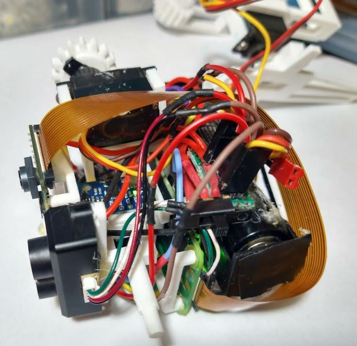

### About

What is it?

A camera, ToF ranging, inertial sensor set on a gimbal that wireless controls a body via websocket.

Previously called: Floating Navigation Sensor Assembly (FNSA)

This is a crude SLAM navigation unit that can get attached to another robot. In the case below a basic 2 servo buggy with a websocket for control.

It's using a combination of OpenCV/depth probing and IMU for localization.

#### Note
Active development is being done in the `dev branch` until a full system is built out and subsequent iterations.

### Actual

### Presentation

[video](https://www.youtube.com/watch?v=znNgf1qtHAA&t=7188s)

### Guts

### Design

### Beam FOVs

### Sensor set

* camera
* VL530X ToF close range wide FOV
* TFmini-s lidar long range small FOV
* MPU 6050 (replaced with 9250)

This is using the IMU for the pan/tilt angles.
