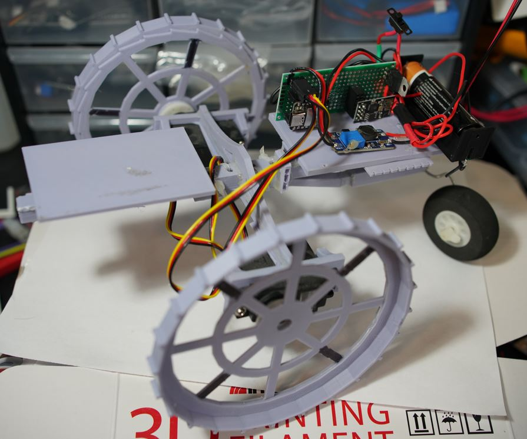
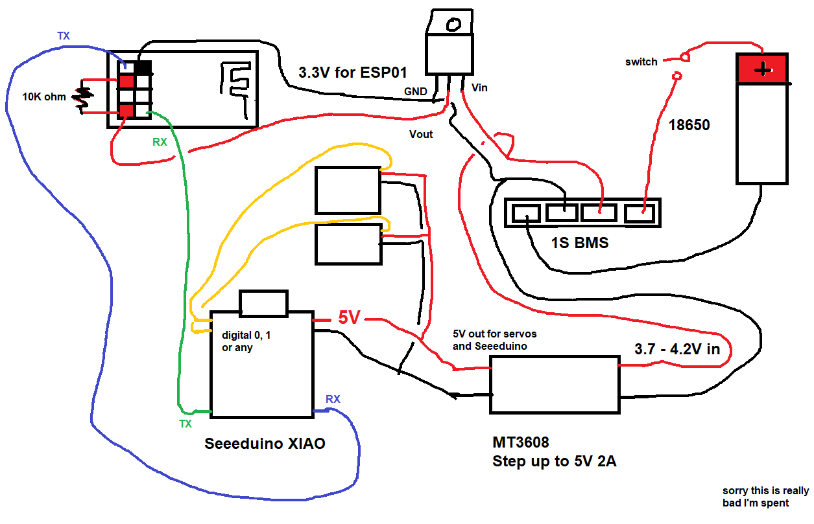

### About

This is a basic "RC car" like platform.

The websocket connection is jank, so there is lag between the commands.

The red/black wires going straight up are just JST charging directly on the battery (I use a balancing charger).

This has a BMS on it which you should be able to charge through but I did not wire it up with regard to the switch.

### Electronics

This ideally would just use one microcontroller eg. an ESP8266 variant of some sort (more than an ESP-01 as you need two digital pins to control the servos with).

In my case while I had some ESP8266-07/12F's... I did not have the programmer slot thing for it.

So I just went with a microcontroller (Seeeduino) using an ESP-01 as the wifi connecting.

### Jank socket

I mentioned the socket is jank, that's on me. I found this webcocket server example for the ESP-01 however it would not persist/stay open. So I added this looping polling deal that keeps the connection open. This means there is lag between the commands.

This is okay for my use case where the message includes the info of what to do so it can be non-realtime.

### Wiring diagram

### Materials (STL info)

See [original project](https://github.com/jdc-cunningham/noob-robotics/tree/master/taildragger-ultrasound-mapping). Actually I just provided sliced files but the sketchup files are there.