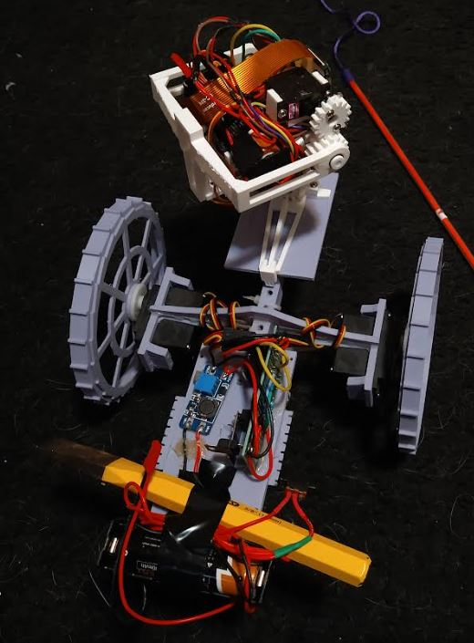

6:53 PM

I was trying to do this on the PBP but there's wifi interference going on

Just adjusting the vertical alignment of the camera

and then retaking the pics to see if the physical changes to the body helped (avoid back-downward slant on camera)

Looks cool, gotta add breaking when it gets to the end of a position, same for wheels. The abrupt stop causes vibrations.
