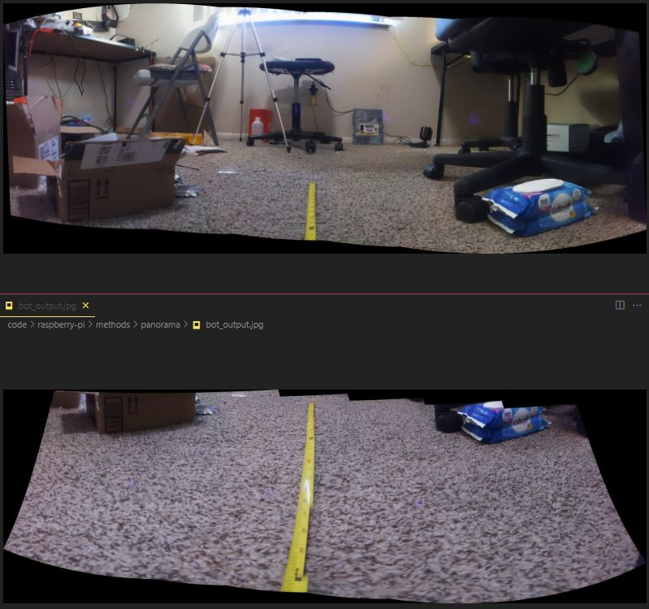
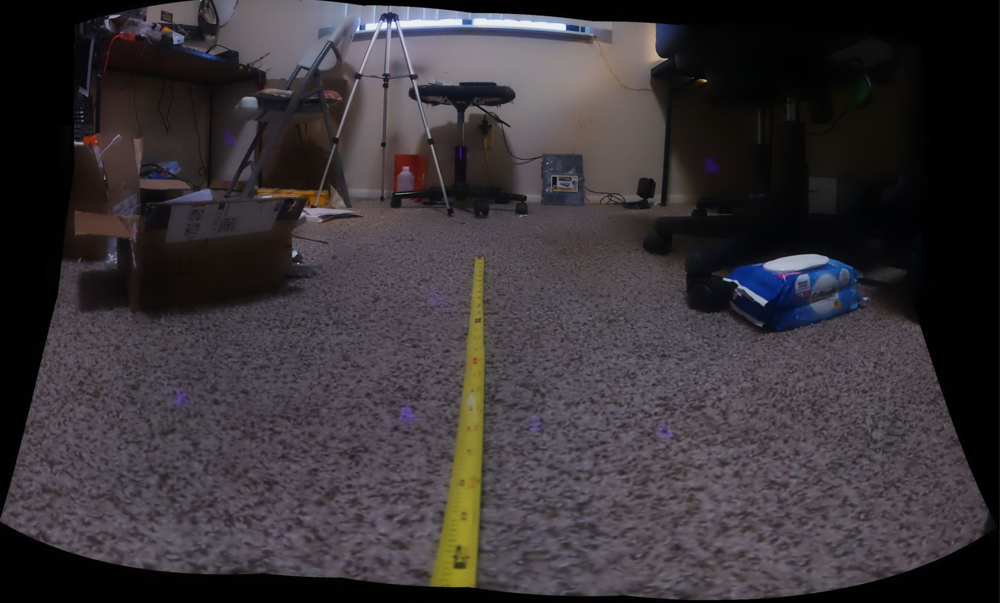

2:26 PM

Alright... slept in a bit much, chilling a bit

Before I enter a food coma from binging let me try and achieve something.

Last time I was able to use OpenCV 2's panorama stitching module/thing to make a panorma so now I have to integrate that into this robot's navigation system.

- [ ] take 6 photos, scale em down
- [ ] perform panorama with all 6 (easiest)
  - alternative is top 3, bottom 3, then top + bottom
- [ ] perform blob finding
- [ ] do pointing math with offsets in mind
- [ ] start doing depth scanning and measurements

I'm also curious on the stitching speed on the Pi Zero 2

2:43 PM

distracted, cat wants to play ha

got a tape measure down to see what's visible

3:14 PM

Damn, stitcher can fail too, maybe too complex of an image to line up

Okay looks like I may have turned too far in either direction

Let me check the field of view

Lowest it sees is 4" away from itself

Let me see if I can just join these two panoramas with each other

Nope... probably need to crop it

Hmm the top and bottom sets don't really line up with each other interesting

Maybe I could try vertical slices... idk

It's odd for the top set most of the right image is not used

I could try taking more images... I think ultimately the issue is how my camera moves around

Hmm... still not working, wondering what if I use the robot's wheels, that introduces new problems though

Will confirm left and right angles

Left side is 40, right side is 42 it's close

Alright... (sigh) let me try more images

holy crap that worked... hmm

amazing... let me see how big it can see

well you'd say 80 degrees FOV at least plus the 40 on either side...

so like 120 deg? ha need to prove that, point it at a wall

Adafruit says 62.2x48.8 deg

https://www.adafruit.com/product/3099

roughly 28mm focal length which idk what that means

A vision of what I want to a achieve, an image where it shows the panorama example, blobs found, and distances measured

I think this weekend I'll finally do this ebay API thing I've been meaning to do

Get myself ready for next year where I dive into FPGA, rust, the Toshiba 50CT project more

My main modus operandi is get out of debt/free myself

Don't think modus operandi is the right thing but ehh, prime directive

Where I'm at

The wipes are from when I bought some slimy chicken and needed to wipe my hands off at the store, haven't used since.

I gotta clean this floor up, I have so many parts, my VR area hasn't been used in idk maybe a year

Will see if I can combine these two layers, it's possible I need to do three, same range but a middle layer

That'll suck...

lol I thought it worked but it's completely f'd dang

omg....... thinking 15 images

dang it failed to generate the final panorama ha

4:39 PM

Wow wow whooo wow (Borat)

There are some issues but it does work..

I might have had it with the fewer images, just needed to rotate to stitch right

it's not as good

let me see if it works on the Pi itself, not the 3080ti or i9 ha

Need to time this process, also the final output is upside down, need to rotate

Dang some cv2 attribute error

Let me time this process

It takes 15 images, 3 second interval plus few second delay per image so something like 1.5 minutes at least is expected

This is definitely not a navigation system for a drone flying through trees ha

Dang 2.5 minutes in failed, same issue

weird it works locally but not on pi

Dang says killed on last step

I'm guessing it's a size thing

hmm let me watch htop while it tries to do the final steps

hmm it does get high up, 272/357M I saw

I'll try scaling the images down, uploading them into the pi

Will try 80% of original size

ooh it made it, well failed first time, succeeded second time, probably need to make it smaller still

What's redundant is when the photos are taken I have initial depth points already

As seen in the purple dots

My concern is if I downscale the images too much I lose too much info... granted it's already 50% of the size originally, then downscaled even more for the pi zero 2 to handle.

So I'm downscaling the rotated images to 73% or something like that

There is a lot of artifacts from bad panorama merges... also these images are too detailed/fine grained to really matter for this robot

So doing a color blob finding thing not sure how well that'll go

let me try a new area

still vibrating a bit, have not added the motion dampener

damn it, it died... was wondering why it stopped moving

