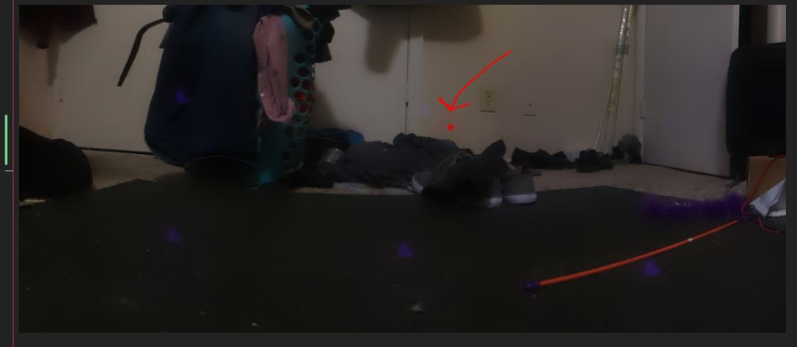
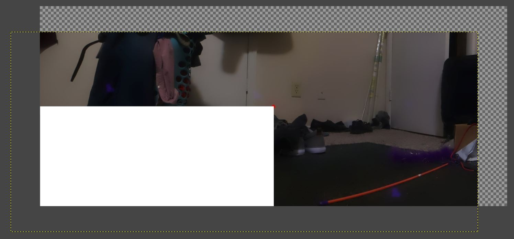

9:57 PM

let me put some time into this, been down and lazy lately

I charged it so the battery should be good for 5-6 hrs.

I was thinking about putting a process in there to log up time, issue is I'd forget to reset it after I charge.

I have to crop the final output

hmm weird pigpio error

When I turned it on the servos did not auto center so something might be wrong with that

Hopefully next restart fixes it

might be from an update

oh said start pigpiod daemon

Takes just over 3 minutes to do a 15 image panorama

10:16 PM

There is some interesting blurring going on

But overall it is amazing the stitcher

Other thing I have to check is, after the crop, what's usable...

98,133

2138,1010

that's top,left and bottom-right dimensions according to gimp

Oh damn... I need a way to know the center image

Put a red dot somewhere

Because if the image doesn't line up with the camera then the aiming will be off

11:08 PM

Oh yeah... that's interesting it's shifted top-right

Most of the image is looking down os it makes sense, crop loses some image on the right

Crap... so then you have to move the image by the red dot to the middle, or offset calculations

The purple things are the lidar

Here you can see how much of the footage is kind of "wasted"... it won't be if I adjust teh calculations but easier to have everything centered

Still it's something

The white bottom-left corner panel is just for aligning the center dot

That'll be it for now
