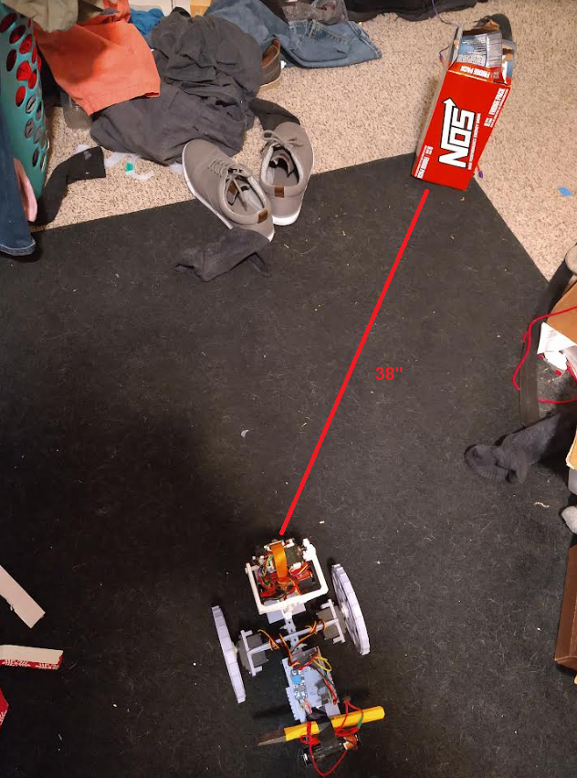
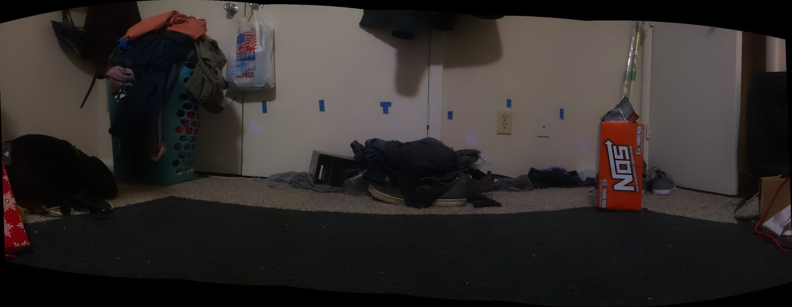
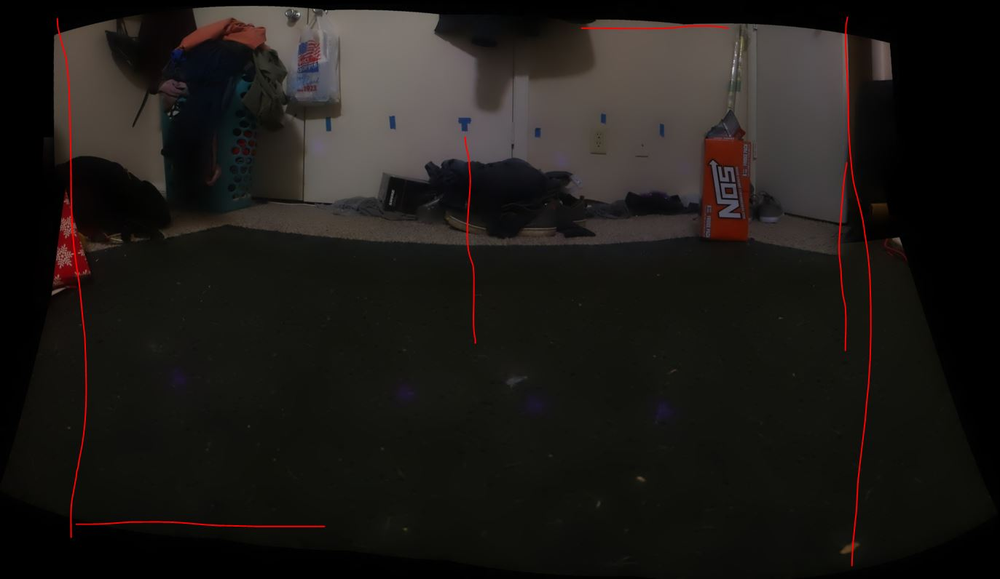

6:00 PM

Let's keep this going

Going to do some measurements/try to figure out aiming

I need to figure out how to get the offset from the red dot

Here you can see an example scenario

The orange NOS box is 38" away roughly

I'll use sketchup to get an angle

36.9 degrees look to the right

Let me get a panorama

hmm have to start pigpiod manually again, will edit boot script

wtf it's already there hmm

ugh... gotta figure out why this isn't running on boot

I had a crontab but it wasn't working

maybe because I changed the repo name

let me search in devlog

6:26 PM

ugh... found it

`/usr/lib/systemd/system/bootFNSA.service`

doing quick test

need to write this down somewhere

6:37 PM

still not working hmm

6:45 PM

journal says it's running but having problems

python import fails from ToF sensor

pigpiod

`sudo journalctl -u bootFNSA.service`

hmm... thought the requirements would already be installed even if repo is fresh

at least I have the requirements.txt

good thing I have notes

https://stackoverflow.com/questions/48941116/does-python-pip-have-the-equivalent-of-nodes-package-json/48941162#48941162

7:07 PM

I wonder if this is because of some compiled file being removed hmm

Ugh... man I have a lot of hardcoded paths, the home folder in particular that's the issue

dang easier to fix in editor than nano

7:19 PM

one quick restart test, then back to what I was trying to do before

going to disable the IMU websocket thread since it's not used right now

7:27 PM

The reboot does not run the boot center stuff hmm

reeeeee

no module named websockets what the heck

it's some ownership thing weird

I started a new repo since the previous one git was corrupted... which I could have just wiped git...

Anyway I have to reinstall MPU9250 library, seems the pip requirments not enough

7:40 PM

should be good now

always makes me laugh when I can feel the heat coming off the TFmini-S

Aye... restart worked back to 0 again nice

Generating panorama

Failed, missing panorama folder

wtf my red dot is gone

I can't tell if it has a bias turning left

7:53 PM

added 1ft blue tape markers on the wall

I need another way to center the panorama if the dot may get removed

Yeah... wtf it looks more to the left/down than right hmm

Actually it doesn't... it's the crop

The top panorama is pretty symmetrical

I should check the precrop shot

Yeah... I need to apply some math that does the cropping based on the dark areas

Something like this

Anyway I didn't really achieve anything today, good refresher

A goal would be to place the NOS box anywhere in frame and get its distance reliably regardless of left/right and depth

