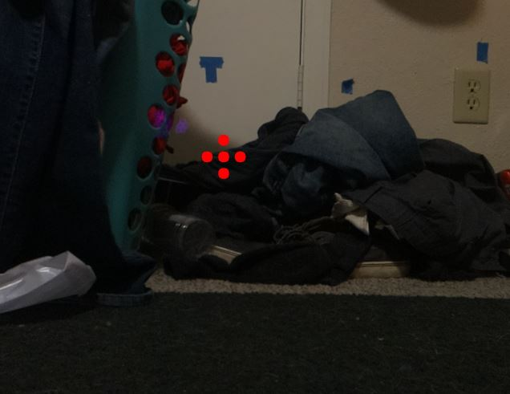
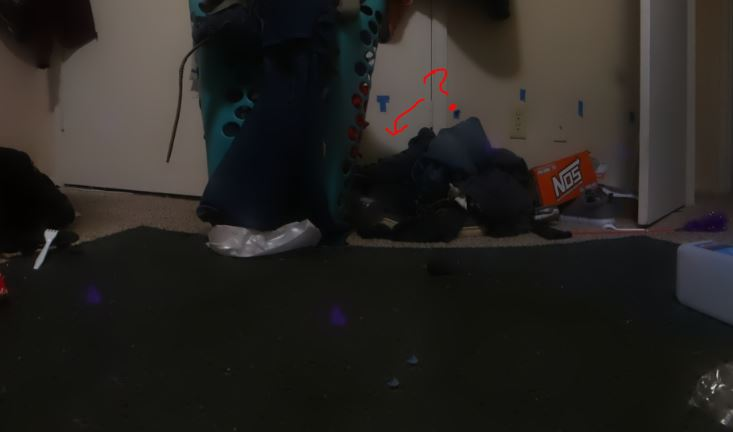

6:26 PM

I do have a headache right now/feel mentally spent, cat's also distracting me, wants to play

6:34 PM

ooh freeze warning down to single temps dang, like that scene in Day After Tomorrow helicopters fall out of the sky

what I'm trying to add is a "cross-sight" in red on the center image, so it is more resiliant than the single red dot

I'll have to add an alignment thing though later

6:48 PM

keep getting distracted, I have a video in mind/vision of all the parts working so I'm working towards that goal

I have some holiday time off hell yeah

7:26 PM

Damn I forgot I have to cook rice, just wrote and posted a shit fluff piece

I can spit this out, just plot 5 dots

this code is super nasty but my main concern is just system design/functionality eg. make sure it works

7:39 PM

crap not far away enough

7:47 PM

omg it's removed... this is what I mean

Panorama output

what the heck... these dots are still too close together anyway

7:59 PM

wtf... it's still removed...

8:08 PM

OMG lol one made it, in newest 300px apart... need more dots I guess

Oh man... there is an interesting failure scenario, when my cat walks into the panorama

That's better 3 out of 5, so I'll add more dots

Man... can't belive the right side is completely missing hmm

Ugh... I'll just do 3 sets

8:35 PM

Alright I'm gonna have to try it with thin straight lines

Need to cook and eat now

10 dots and only 2 survive dang...

