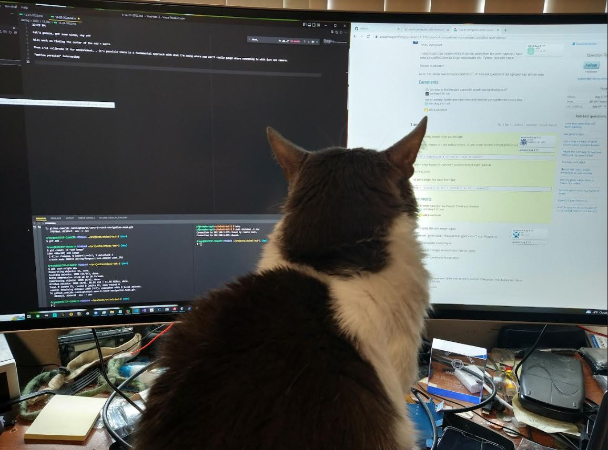
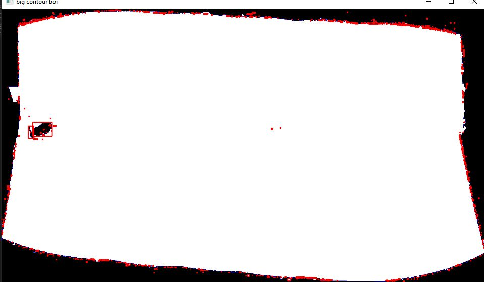

12:27 PM

Let's gooooo, got some sleep, day off

Will work on finding the center of the red + parts

Then I'll calibrate it for measurement... it's possible there is a fundamental approach with what I'm doing where you can't really gauge where something is with just one camera.

"motion parallax" interesting

How do I get anything done like this

There is something else I have to do, I have to find the optimal crop

It's -5F right now and it is cold haha, window behind my monitor, I feel a breeze, got the fold at home running on low to generate some heat

I have to come from the top and find the lowest non-black pixel and then from the sides, lowest meaning towards the middle.

Ha 8 years ago
https://stackoverflow.com/questions/23847627/cropping-panorama-image-in-opencv

My approach would have been to use 4 loops which you could use just one

ha written in c++

anyway I think I can do this, I just remember iterating through pixels was slow as hell

This photo is 2535x1309 as in roughly 3.32 million pixels

That can take some time

12:53 PM

Wow yeah... this is super slow

will take a few minutes to iterate over all the pixels

12:59 PM

hmm

https://stackoverflow.com/questions/72575930/remove-all-black-after-opencv-homography

think I could cheat and use imagemagick lol

this one looks good
https://stackoverflow.com/questions/10632617/how-to-remove-black-part-from-the-image

I've used findContours before, it's the main thing I use to find blobs

1:15 PM

hmm that approach is failing

1:24 PM

oh yeah I saw this boolean matrix thing before

https://stackoverflow.com/questions/13003949/faster-way-to-loop-through-every-pixel-of-an-image-in-python

1:49 PM

still struggling

1:54 PM

I'm going to go for the dumb approach

I don't think it'll take too long to iterate 4x of roughly 80x80 or so loops

vs. 3 million straight up

2:14 PM

ugh... the axes are backwards from img as in index 0 is y not x

2:22 PM

Damn my toes are freezing lol, it's definitely cold #thank_science_im_not_a_neanderthal

2:56 PM

Yeah... my approach doesn't make sense

There are many outer points before you get to the corners

What about... making th largest square from the corners and then using those

maximize the four points and choose the lowest two/opposite corners

3:03 PM

let me go back to the countour finding code

3:17 PM

ugh... not working

The red areas are squares, so it's not able to find a contigous area larger than the black spot on the middle/left

3:32 PM

spacing out...

damn can't believe I still haven't solved this, even the crude way of coming in from the outside out to work

the mask is interesting since it's an easy 1 or 0 (white/black)

3:37 PM

There is another dumb solution I can think of, iterate over entire widths and find the largest non-black set, do that for all four sides... sucks

You could also do "middle out" guy watches silicon valley, where you know the middle area has the largest concentration of pixels as a base line for comparison

3:44 PM

I've actually been approaching this wrong anyway

since the outer corners are not the "inner most" pixels... eg if you crop from there, you would still have black gaps in between the corners

the other issue is the edges of the panorama can have black areas so hard to tell where the edge is... in general you know it will be a rectangle

I might call it here today... will just chill, work on other stuff, sucks

