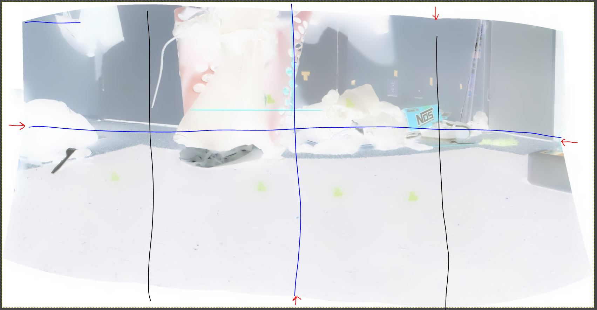

2:15 PM

Happy BDay to me, hit a new decade damn, time flies

I want to achieve something with this project as I want to switch back to the TLR project, that has more followers than this (almost 200)

They both use the same principles though related to navigation (probe things, IMU for tracking where those things are over time)

2:25 PM

getting distracted, been having to stay up late to talk to family so my sleep pattern is f'd

2:40 PM

still mad distracted, anyway here is the new plan

(inverted colors)

I will start iterating from the middle out, since I know/expect the middle area to be there/kept.

So to find the top crop, you have two loops: left and right, going middle out, find lowest point

I'm thinking I should be able to do it from 25% out (black lines)

Another way to think about it is, the largest black pixel slice or white in this case

For the vertical slices (y plane) you would start from the middle of the image, check deepest it can go till it hits color pixels (could be problematic if perfect black objects)

The deepest would be a join point like you see with the blue line

oh and then if I cut the image then, it would make the top edges obvious

It does suck, how much image you lose, by cropping

But I don't think I will try and use the stitched parts with new images... you would turn the robot some known amount due to average FOV, with some known space being in frame for stitching

**GOAL** Ideally would have it do a full 360 panorama scan/probe and then it can figure out which way to go... normally it just moves in a direction that allows it to eg. scan once, go forward if possible or turn/look somewhere else.

But a 360 scan would show that it has a true mapping capability.

Okay... this is not efficient but something tangible/I can achieve with what I know.

2:56 PM

my god I keep getting distracted, turn the memes off

3:15 PM

So I tried it... drawing a cross hair on the pan output shows that the left y part is below the expected target/down

the slope is not intense so even 5, 10 deg apart difference is only 1 px

will use a big number to be safe, ideally it would try and increment

nah... I'm concerned that I overshoot the middle, so it'll have to do 1, if same try increasing upwards

3:29 PM

I can refactor/write efficient code, I'm just trying to get it to work right now, so many other parts to get to work to form the whole system

3:32 PM

problem is this code contradicts what I expect to happen

3:36 PM

Hmm... when I look at the mask, it is not perfectly black on the outside

I think I'll have to do an average

3:55 PM

ugh.... this code is soooooo bad

