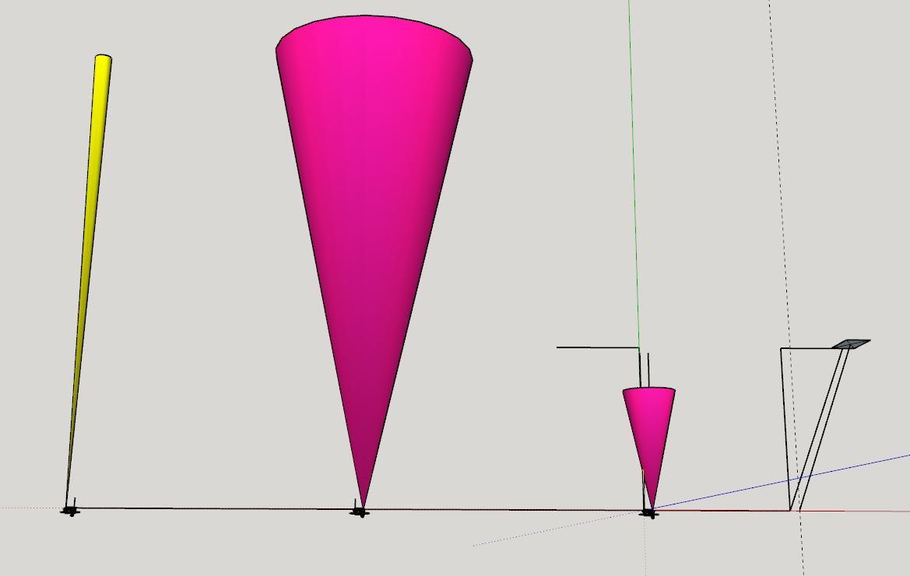

12:23 PM

Ayeeeee Christmas

This 5-days off in a row has been great

12:40 PM

taking notes, a little distracted

I will start doing measurements today, I want to have accurate distance finding by my test NOS color box

12:49 PM

still not focused, let me use my trusted playlist

these are not absolute values, parallax issues

7.38" camera from the ground
7.00" tfmini-s from the ground
7.88" tof from the ground

0.79" tof left to middle (camera)
0.96" tfmini-s right to middle (camera)

The sensors are centered with rotation, the camera is not...

but camera output (pan) should be centered

Oh yeah I can add vertical lines on the middle scenes to hopefully help with the panorama gen process

0.42" camera is above tilt midpoint/sensor centers

actually the vertical lines on other photos would probably not help

I think I'll add x and +

1:10 PM

Crap I'm missing a line from the x

These x's will also cause problems in the contour finding since they are applied on the final crop, I need to have copies without them

1:20 PM

wtf my tof model is not right in sketchup, the sensor (black rectangle) is on the wrong side vertically hmm

1:24 PM
ugh... I'll do the crosshair replacement now

1:32 PM

oof nasty, even longer generation process

The crosshair is for figuring out what is the center of the panorama.

From there you would know which way to do pointing with the sensors relative to the image.

I still ahve to reason out the distances/what is visible.

I think it is a flaw about FOV/pointing since you can't tell if a tiny thing is tiny/close or far/small.

The sensors will determine which is which.

1:37 PM

I have to work out the pointing geometry

convert pixel coordinate on a photo to angles on servos

the pan/tilt angles are not mapped right now, have to do manual at first, then tie to IMU (this would be the intended feedback) vs. say a rotation encoder

I need to start doing some manual measurement testing to make sense of this pointing

1:49 PM

okay this test, the NOS box is

11" right, 44" - 9" away from camera

Eventually I do want an interface for this robot, with telemetry

Not hard to make just something on the list

2:05 PM

feeling distracted

ugh... gotta do it twice, the auto crop, even more delay

2:13 PM

getting a drink/snack, will measure the face of the NOS box

I'm using GIMP to get the expected pixel values from photos

oh damn forgot new episode of Witch Gundam hell yeah

2:53 PM

ooh that was a good one

got about 3 hours left before I have a big break, probably done today on this project

minor file name mistake

all these heavy image writes to SD card probably going to kill it faster.

3:04 PM

okay new pics taken

NOS box is 5.125" x 10.75"

So with trig/sketchup the box is around 37.54" away

37.59" if going from direct cam to NOS box center

charging the robot in the mean time

44" - 37.5" is the FOV base, 6.5" away from itself

There could be a top-down, dumb check

Do a ranging sensor(s) scan first since if you know you are facing a wall less than robot dimensions then it's not worth going forward/doing the pan process

I need to put these dimensions down somewhere

11.5" long, 8" wide, 8.75" height max

3:20 PM

distracted

3:29 PM

back on

I have lost drive for sure...

- get crosshair center
- coordinate for blob

It's hard because I know the camera's center... if the image is above the camera's vertical midpoint, that means it's far away right...

in this case it's in the middle of the NOS box

so, you should be able to just point right and hit it... which you can since the box is 10" tall and the camera is 7" tall

Of course depending on which beam is used...

cross section is a factor (tof 25" cone = larger reflection area needed far away)

1156, 377 crosshair center

1536, 408 example coordinate

offset by crosshair center

3:45 PM

got a call with a friend coming up will take a break

this pointing thing is going to suck... just a lot of problems

one is like, where is the floor... convenient that it's the same color in my case, of course just point the beam down and find it...

but easy to assume no holes in the ground

I think another thing to consider is since the purple tof sensor is so wide, you'd use it for close stuff, things that are far away you'd use the lidar for, both have different offsets

4:15 PM

alright back on

another data point to grab, size of NOS box in pixels

roughly 129x267 pixels

need to know

- sensor offsets
- widest beam by distance

I can work out the angle to point by trig but I already know the values

21.2 deg

I need functions that return the surface area to be hit, by known distance

4:37 PM

Yeah the 2 deg FOV of the tfmini-s is insane

Can see here, at 100" away how big the FOV is for the minimum cross section/positive surface hit response per sensor

dang this is hard...

59" is where the center of the camera overlaps with the tfmini-s fov

at that point, the FOV is like the camera's center view (rotate head, looking at something head on/measure it)

For the tof sensor it's 4" away ha...

the problem is the FOV is so big, on the tof that you can't tell if you're hitting your intended target or something else

this measurement is easy actually since it's the closest thing/object in the way

