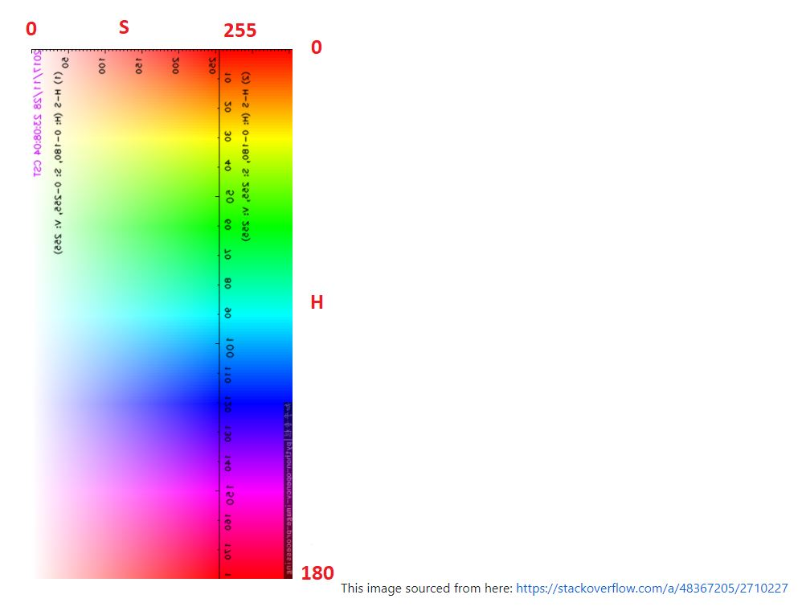
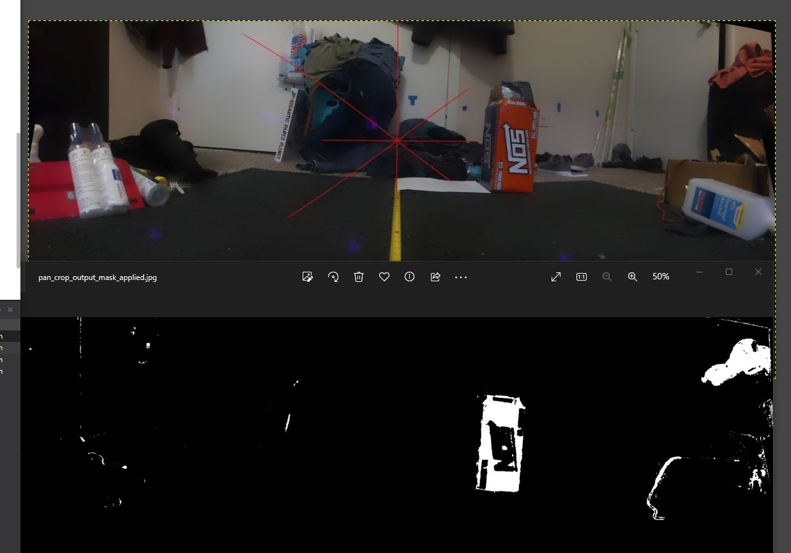
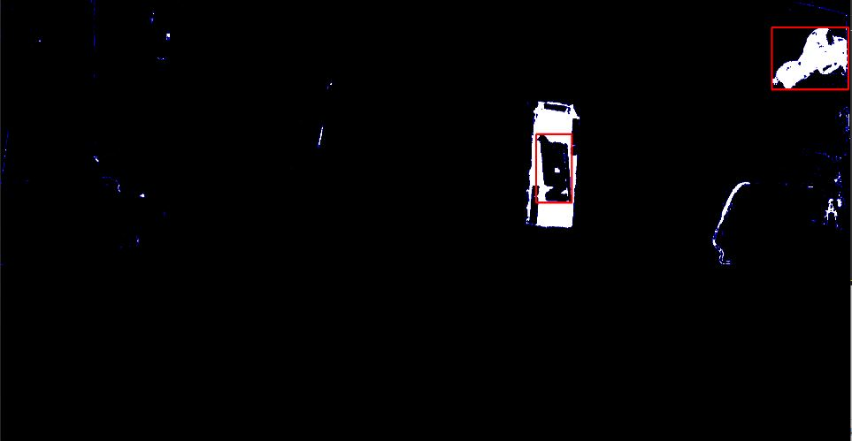

2:10 PM

Let me try and get some work done before food coma sets in

I just shopped/re-upped on food

2:14 PM

a little distracted, not sure how wide to pan

I'll visualize it

I'll go for 120 deg, 60 deg in either direction

center pan is 1460, increasing turns left, decreasing turns right

I'll have to setup a camera to be directly over the robot as I try out some values

To capture frames to use with SketchUp and dial in/write a formula function deg to ms

2:29 PM

mad distracted, let's go

1.5 deg to the left, starting photo

38.9 turn left, 37.4 true

35.5 right, 34 true

not symmetrical

400ms turn either direction

2:47 PM

anyway... a first guess is

3:09 PM

alright let me check how accurate it is

next sample

2.6 deg left neutral (hopefully just from camera)

46.5 left, 43.9, so it's a deg off

46.8 right, 44.2 deg

see what I'm doing

I think this offset is acceptable since the FOV's are big/rough estimates as well

it's probably a rounding issue anyway that tiny deg off

3:19 PM

now I have to do a tilt setup (camera)

after this I think I will go for it, be able to produce a video of the whole flow including the HSV/mask application/find item coordinate, point beam at it, get distance, overlay

I'll be able to rest at peace with that... for my break

feel like I achieved something

3:27 PM

tilt servo increase to look down

the camera/sensors may not be vertical at rest hmm

3.2 tilted backwards, negative from vertical as neutral

17.6 look down at 220ms, 14.4 deg true -> 15.28 multiplier

3.9 neutral

23.6 up, 19.7 actual -> 11.17 multiplier

repeatability is an issue, go back to neutral and it's slightly offset

4.2 deg back, 14.5 up

3.9 back, 9.9 deg down -> 15.94 I think you add it right

so pretty good... well, the offset... hmm it's not good actually

that seems too much hmm

3.9 back (up), 14.3 to vert -> 10.4 close

4.0 back (up), 10.8 to vert -> 14.8 deg...

not correct

3.9 back, 6.7 up -> 10.6

oh damn... I will have to center the vertical and do it again, crap

the pointing is correct... but it assumes it's centered and right now it's not

... oh yeah there is one thing I didn't consider, that assumes camera is level, should have looked at internal meter
, I used small stacked boxes

they all look uncrushed/symmetrical so should be good

Okay so that's centered

4:20 PM

next thing to achieve this full flow is to write the orange mask/centroid finding part after generating panorama

this is all known code/stuff I've worked on before... do I have the momentum to keep going, I would like to produce a video

4:26 PM alright let me see if I can do this, feeling sad I randomly started singing some Her's to myself

- generate panorama
- find orange box
- determine orange box pixel coordinates, translate to deg
- point and measure distance, verify with tape measure

well shit... it died

I can still write some code while I charge it, I think I still have some old images

oh damn... I can't do it... need to find the center of the red diagonal

I'll go off known values (cheat by using GIMP to get pixel dimensions)

In the sample above, the center of the image (cameara FOV center) is in line with the orange box target so it doesn't have to look up, just look right

The horizontal center of the orange box is 376px

The FOV of this image is roughly....... it's big since it's a panorama ha

I need to figure that out, point it at a wall with tape measure

From trig since I know the distances already, I know the angle

21 deg, so I should be able to point at that (with functions written above) and do a depth probe check

I'll do the mask find contour process now it's a 3 step process

The process I'm doing is explained below

https://github.com/jdc-cunningham/slam-crappy/tree/master/vision

I found this HSV chart that's useful for me

4:41 PM

gotta water my plants real quick

4:50 PM

got the plants some water, alright, I have this 72hr reminder sms thing

the thing with the HSV is I'm manually looking what colors are available or I already know what it is, in this case orange

But that's a process that is supposed to be automated too, the HSV thing opens a plotter which you don't want, just want arrays

4:55 PM

anyway the matplotlib stuff won't run on pi headless

Here you can see the mask applied for orange roughly

I did the 1D histogram to get the V value beforehand

From this you use find contours to hopefully get the center of the NOS box/other areas that are in white

This output is technically not good, should be outside the NOS

but can see how this would work...

I've done the center dot of the red boxes before as well

I have to do more polishing in the intermediate steps, I almost have the full workflow down

I think I have enough power to record a video to put something together

Then I can take a break, chill rest of the day

I'll keep working on this, I have the flow
