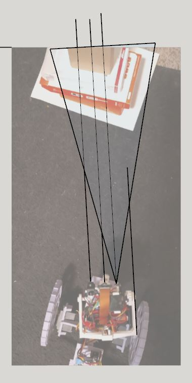

6:45 PM

kind of beat, I want to do a couple of minor things

- get a FOV sample (known real width)
- do some aiming/photo taking with the purple lidar patch nad preview

7:04 PM

playing with the cat

7:25 PM

6' away it's wide... wider than my wall so that's not really helpful

try 4'

7:33 PM

everytime I try to generate a pano my cat photobombs it

may have to print some wire guards to make this robot be able to handle the cat

or do the processing faster

yeah he tries to chews on it... not good

damn 4 ft away it's still too wide

16.2 deg to hit the target

unturned 17.125" away

17" turned from camera

sensors measure 17.94, 16.77

lidar is pointing at box more than tof (probably split beam)

hmm it looks like it's hitting it but completely misses

oh right left side is tof

ehh... I need to do this better, with photos

I have another long weekend coming up can really sink time into it more then if needed

I'll try again tomorrow, cat's been distracting

I still have to work out the overlap path/expected distance fov cross section size stuff

so far what I am seeing is not good (not accurate)

Yueah I have video proof the lidar is hitting the target, so it's accurate at 15.99

well not really, actual is 17.5

tof is 17"

target is 3.5" x 5" -> 17.5 sq in... need 25 deg circle diameter that far away

yeah real time connection is easier to work with

will need to update it to pass in deg commands

gotta stop for now... nto sure if really usefull... still have small bits to add here and there, and need to do a lot of testing

learned a couple of things though I suppose

8:07 PM

circle is 9.88in diameter, about 76.7 sq in

target is largest near bottom (stack of boxes)

target size is 17.5sq in + 40sq in roughly

the circle is larger than the target

this is where the sensors have to correct each other/have some known catches

