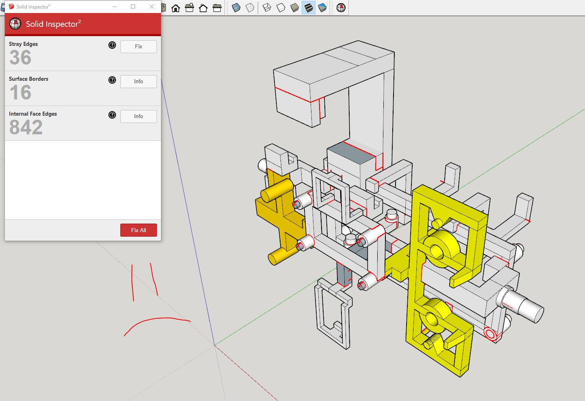

### Sunday 07/31/2022

8:45 AM back at it

I've got my gears figured out. I need to finish designing the pan/tilt assembly, make it, fix some measurement issues then fully assemble the body.

Then add the basic electronics to the buggy that it will drive.

10:21 AM

Man this is slow. I did some cleaning earlier but that was only like 20 mins

Damn I'm losing steam, realizing how much time it will take to print stuff

11:05 AM

I need the power of the poompa (my playlist and headphones)

Drown myself in music to get through it

# YEAAAH YEAAAH YEAHHHH AHHHHHHHHHHHHHHHHHHHHHHHHHHHHHHHHHHHHHHHHHH

(Scorpions Blackout)

11:29 AM

bearing press fit print test, too loose

11:45 AM

Once assembled, this thing will not be easy to charge. I just realized I will have to change the switch for a JST and then I'll disconect it to recharge it through the BMS.

I have actual chargers to use but I can't just pop the cell out.

12:05 PM

Screwing around with bearing fit, went inwards then outwards (undo) like for real

2:12 PM

Starting to print the big stuff, still designing sensor bed

4:26 PM

Damn... a 7hr print lol oof

Ahh man the sensor bed model is so bad... so many broken surfaces.

I think I'm going to have to dissect it and rebuild each sub part.

Ugh... this peg support thing broke off and it's just dragging non supported plastic threads around hmm...

Thankfully I can save most of the print/still use it. It looks flimsy though.

Nope in the end it failed at 80% dang... just because of that one overhang/support that failed.

Anyway the base is too flimsy, need to redesign it.