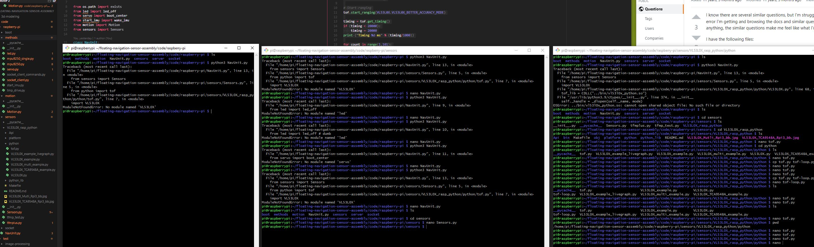

7:03 PM

Distracted today, late start but I ate fast food so I have energy from my usual dieting self

I did do a time check and the system lasts just over 6 hrs like near 6 hrs exactly.

Does this help me? Not really since there's no way to reset a timer after being charged... but good to know I guess.

Today I'll finish interfacing with stuff, with regard to the classes

I'm going to develop the first navigation version and then I have to take a break to learn some Swift boy... I'm also learning Haskell lol or was... so yeah...

"learning" quote on quote

7:36 PM

I'm super distracted... not making much progress

7:55 PM

damn it Jacob get to work focus

I'm pretty much moving the prototype sample code for each thing (servo, sensor, etc...) to the actual class

8:25 PM

hmm... definitely squeezing crap in there

I'll be good and add a pip requirements file

ooh... https://stackoverflow.com/a/48941162/2710227

looks easy enough

8:43 PM

Hmm... weird import/path issue for VL53L0X, taking a break

FEEEEDING TIME! WEEEEEEEEEE (pig sound)

10:41 PM

ugh... okay let's go, my hands are super dried out

11:00 PM

Ugh I'm stuck on import problems, I fix one thing it breaks others



hmm

I know i should mock the sensor endpoints/not code against the Pi the SSH adds lag

The VL53L0X has a relative import eg. `../bin...` which was fine for its purpose, I had to modify it

I don't really know what the hell I'm doing with all these imports so

Oh yeah I can't hook up the websocket now but I'll dump some data from every sensor to make sure they're callable

ahh... damn it... it's not working right, I fix it here, broken there... hmm

Alright... I'm dumping some nasty stuff... gotta stop for today

The imu has problems, I think I'm like double calling stuff, I turned off the boot wake in case the "register set" being called more than once is bad, although I'm already doing it

It's also concernign the extra junk being dumped

```
python3 NavUnit.py
tof check
VL53L0X Start Ranging Object 0 Address 0x29

VL53L0X_GetDeviceInfo:
Device Name : VL53L0X ES1 or later
Device Type : VL53L0X
Device ID : VL53L0CBV0DH/1$1
ProductRevisionMajor : 1
ProductRevisionMinor : 1
VL53L0X_BETTER_ACCURACY_MODE
API Status: 0 : No Error
Call of VL53L0X_StopMeasurement
Wait Stop to be competed
API Status: 0 : No Error
319.449
lidar check
115.83
```

That's the dump from the startup sensor check that would post to a web interface by websocket

