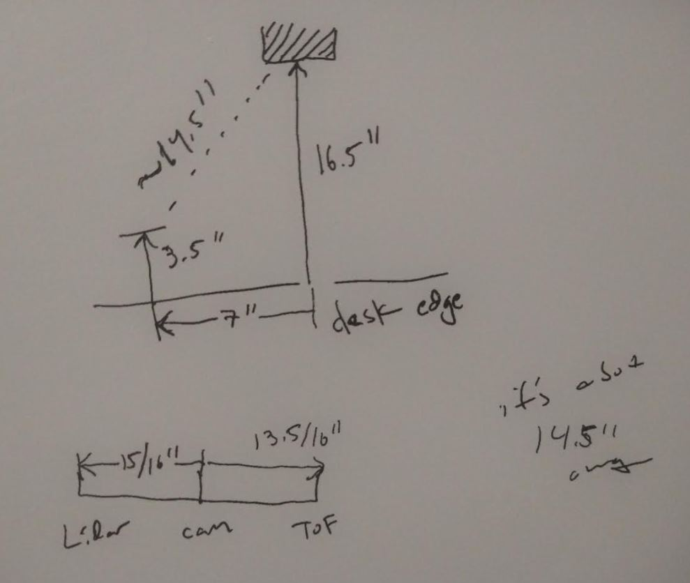
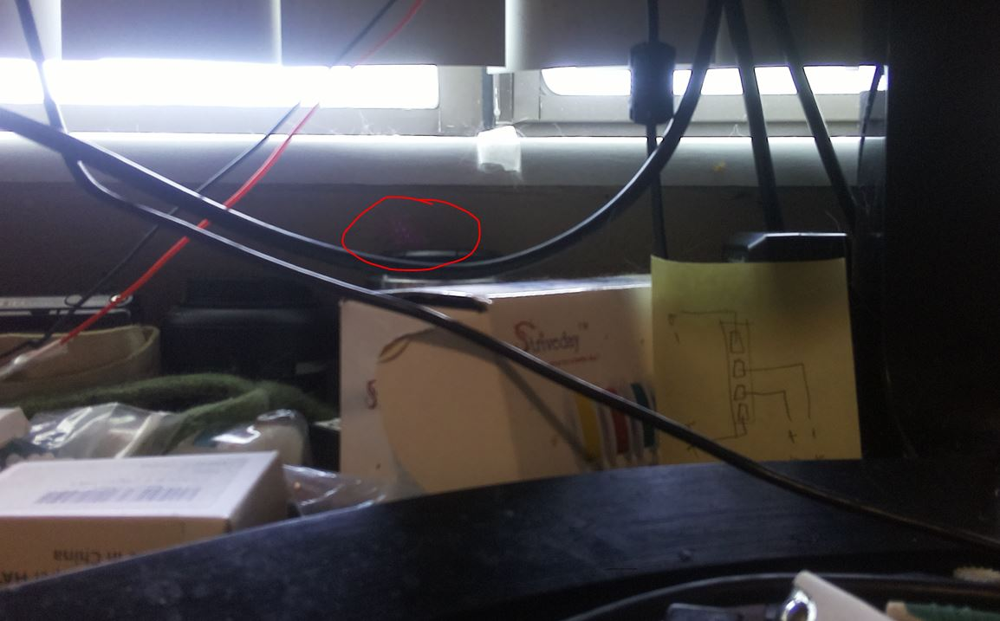

9:04 AM

Ahh... fresh day fresh day, all for me...

Slow start, looking at social media, bad Jacob

9:11 AM

I'll switch to OpenCV related work when it dies.

Need to take note of python3 version I'm running on Pi and match on my desktop

3.9.2

I do have a video to film in mind, but it's just pre-programmed stuff not actual navigation

I still can't aim. I think I need to make a test stand.

9:20 AM

updated servo pan center

hmm.... might as well start image segmentation now, I could also start the IMU stuff

I had a test thought (move it across my desk) to measure real value

9:23 AM quick break

9:57 AM back

yeah I'm not feeling it right now, ugh my i key is dying

I stll can't aim the beam right now

I did have a thought that it might not be good enough... the beam should have been at the exact center of the pan/tilt intersection not on the side oh well

10:19 AM

still not really going, cat is in the way of the test jig

What also has to get factored in is pitch

Z-heights

3" + 3/32" lidar

ToF 3" + 1/8"

Camera 3.5"

10:25 AM

I'm going take a picture and start working on the image segmentation

10:35 AM

Damn... this lense is not as wide as I thought, not a bad thing

but the target is not even in view all the way

Move it 2" in from the left

This is interesting... I could probably figure out the FOV of this lens from taking samples or just look it up!

Says 110 degrees but idk what that means right now

Point is... if I see something in frame, it should provide a clue as to how far away it is... but also it could be very close or very far...

At least what I'm doing a mask with is black so that's easy to figure out the values

Oh damn... you can see the lidar reflection with the camera ha

I saw this on my screen one time.

I have to count pixels and do math

Expected distance is now 13.75"

Oh yeah I forgot I am on a time crunch since I have to wrap this project up momentarily for me to transition to learning Swift for a Hackathon I'm doing that'll happen in beginning of Sep.

I wanted to get a V1 navigation out.

hmm it's not working well

https://stackoverflow.com/questions/54644357/how-to-detect-black-colour-in-a-video-cam-using-opencv

https://stackoverflow.com/a/55710477/2710227

11:12 AM

Yeah this did not just work as I expect

12:30 PM

getting distracted

12:54 PM

I'm losing steam

Unit's probably gonna die soon but I don't need it right now, so I'll charge it

1:43 PM

Gaming break, might work on a different easier project too

But come back to this as I run out of time for today

Then tomorrow I'll do more work