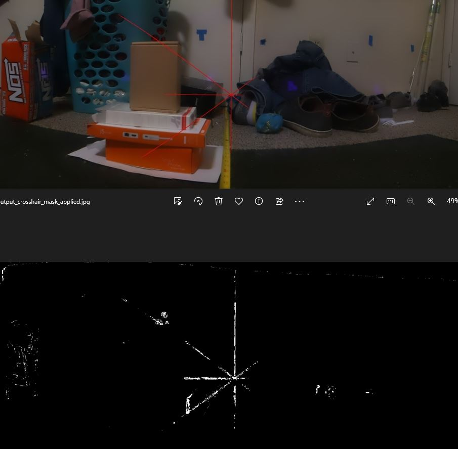

6:41 PM

I'm always tired af at this time, not sure what it is

I will start working out/lifting again

Been experimenting with food, anyway I got some new ideas

* perspective transform
* hue filter
* HoughLinesP
* contour finding (have some experience with this)

man I'm so spent... sucks

not sure if it's like a blood sugar issue or what

6:55 PM

I'm distracted

One good thing is the cross hair center point is in the upper half of the panorama

So that'll reduce the search area although it's mostly a left-to-right issue

I think if I work from 25% in to the right, as well as 75% right to left.... that'll cut it down fast

I'll do the mask approach as that'll help I think

7:01 PM

Jacob please... write code come on

7:13 PM

wtf I can't mask off red

hmm

7:23 PM

okay so an HSV range of

(0, 100, 0) to (1, 255, 255)

Filters out the red cross hair pretty well resulting in this

although I got this by tweaking not by what I expected to happen with my previous process

this is still rough though... better to just go for the red values.

I'll do some manual testing (crop an image in GIMP to get coordinates) then I'll know what pixels I should expect.

I'll need to use slope between points to find the intersection

