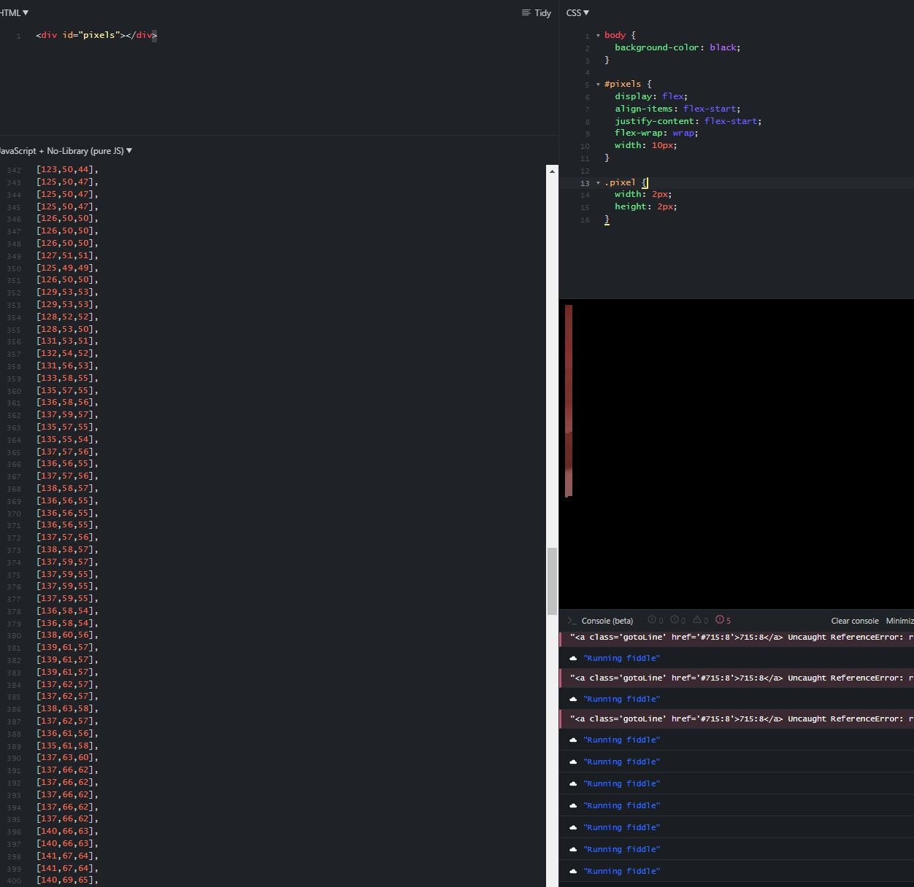

9:11 PM

I have some energy left, I ate some junk food about 3 hours ago

I had a thought about the panorama gen process, I might as well get some depth samples as it moves around... bare minimum the 15 points.

An immediate test is if there is an obstacle directly in front by scanning before even moving.

9:19 PM

cat scritches

I was trying to write an algo to find the red x center

wtf... GBR2RGB doesn't change the values lol, just moves them around

https://stackoverflow.com/a/50963621/2710227

wait... but that's okay?...

this is interesting

https://stackoverflow.com/a/55537339/2710227

find all blue pixels

with numpy

9:30 PM

alright I'm going to crop I'm blind

hmm the pixels are indeed black curious

I might be looking at the ground...

omg my axes were backwards... wtf

maybe it's the rotation of the image, doesn't match what windows has vs. what python reads

yeah that's it... geez

I mean I looked it up... oh well

it should be [x,y] not [y,x]

this red is not perfectly red which is concerning... will need a threshold

193,17,19

I'm going to have to figure out a range somehow

laziest way is to crop a thin sliver image and iterate over it

9:50 PM

sidetracked, boy got that Nujabes Aruarian Dance going though cliche lo-fi

dat algo is mid they'd say to my code

I want to not be poor, my life is constantly in anxiety

wtf... the indexes are backwards somehow... you think x is for row, but it's height/y

ugh

10:03 PM

okay so I guess I need min/max set

I wish I could dump color into the console somehow

I could write some JS thing I guess

10:11 PM

that's odd... some have double whitespace, others have one between pixel vals

10:20 PM

Here it is

Those are definitely some shade of red

This one is super red...

so yeah I'll use this to come up with min/max thresholds... the pixels should fall in there

sucks... can be too many... it's not impossible for the red crosshair to be perfectly on something red...

they suggested I track the center of the image as it goes through the panorama process... that seems hard/would take time to learn

I could also do multi-color cross hairs, like different ones, blue would be one or bright green, unusual colors that would contrast against the inside of an apartment in this case

although those colors are very possible in an apartment

this is something

I need a tasks list

