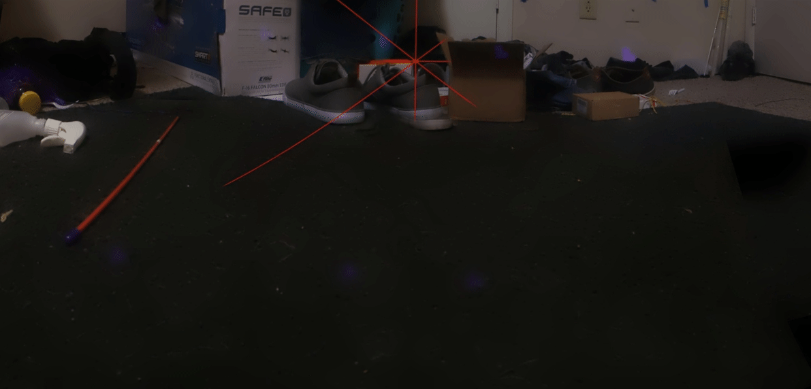
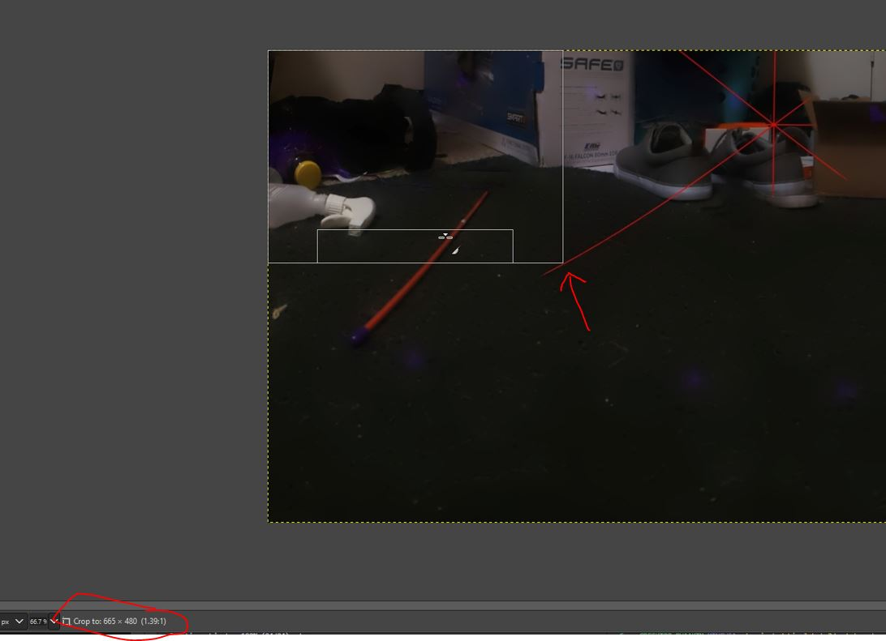

5:44 PM

I'm feeling positive right now regarding energy

This seems to work well for me right now:

- cup of coffee (spoonful medium ground, per cup), pb&j
- cup of coffee, pb&j
- can of NOS (normal sized can)
- Tuna and Mayo around 4 PM

here I am now... don't feel like having a miserable headache

I had the order switched before eg. sandwich, tuna, sandwich

I'm also still not working out but looks like I'll do some physical therapy to fix my knee

back to this...

I'm going to figure out the min/max red color range

then hopefully that's not like a O^2 type algo with regard to two loops

5:50 PM

for center_sample (brightest red) it's

120, 8, 8 smallest
197, 48, 49

oh damn... just had a thought, depending on what the red crosshair is over, the value will change, if it's on a white background vs. darker

99, 35, 31
152, 94, 95

so...

take the largest of those numbers

99, 8, 8
152, 48, 49

is our min/max red values

758 earliest left out of 2415, so 30% in from th left... 40% of the image to sample

20% in from middle

I'll do large gaps though like 50px separation

6:05 PM

what would be a fast way to see the comparison is to draw/replace the found pixels in range with a new one eg. green

oh wtf... man the pan outputs are different... are you serious

the size/output of crosshair and non-crosshair panoramas are diferent

oh my goodness... wtf... the crosshair one is taller...

I'll have to re-run this, make sure this is true and not a stale files issue

6:11 PM

running panorama

6:17 PM

still processing, I thought I was exaggerating the 10 minutes but no I think that's fact ha

6:18 PM done

they are different... the crosshair influences the panorama, actually can make it worse

well, the difference is not massive

this thing has so many sources of inaccuracies... oh well

it's about the journey, what we learn along the way

6:26 PM

I can't wait to have all the parts working though, the whole system running

it's crazy though the variation on the deformation of the crosshair

keeping track of the center of the image throughout the panorama would be a good approach but that means I have to modify the library's code

damn... this is going to be the slowest algorithm ever made

imagine... like 1000 iterations, times 6

oh man

6:45 PM

ooh looks like it's working

Of course I still have to do the actual slope intercept algo

based on 4 points

6:50 PM

so yeah pretty much, you have a piece of the crosshair that's like a > or < depending on which side you hit

Then you get the first 2, vertical interception points from the vertical single pixel slice/sample

then you get another set at some offset x, then you have four points

find the slope between the top two, find the slope between the bottom two... then find where those two slopes intercept

I gotta remember how to do math `y = mx + b` lol

6:55 PM

oh yeah and then proximity matters, the red lines are not just one pixel

okay yeah this process works, it's not terribly slow either, due to early range termination in the pixel_in_range check

I want this infinite zoom, snapping, canvas to make flow diagrams with

These mostly exist like miro

7:04 PM

dang it, I can make this, just writing code but  not feeling it right now

made progress though
