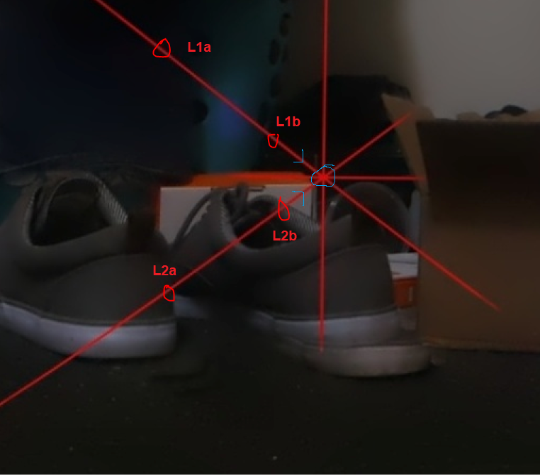

6:11 PM

I do feel like crap idk... but not too bad

I feel spent, mental headache, pain near back of left eye

I have a standard 9-5 job remote thankfully but yeah

Normally on my days off at this point I'm spent

Having a job sucks that way where a huge part of your time is just gone... minimum 40 hrs a week but yeah that's how it is less you free yourself.

This hobby won't do that since the stuff I make is garbage, unlikely to affect the industry, it just helps me learn more and it is fun

Anyway I'm going to work on this slope formula... the first thing I'm going to do is verify the math

I was thinking about it, I think you can find the slopes by using trig and sine/cosine

But I'm curious how `y = mx + b` does it

I'm proving the math via GIMP and points

so the image above, these are the points

1138, 168 crosshair

L1a 1000, 60
L1b 1074, 118

L2a 1000, 269
L2b 1074, 2016

This almost makes the + not needed... it's possible it's not needed

There is also the issue where you're too close/not many things to use as reference points for the panorama = need to use less images for panorama = 3x3 vs. 5x3

6:25 PM

ehh I'm not feeling it, I'll dump some time into this tomorrow

