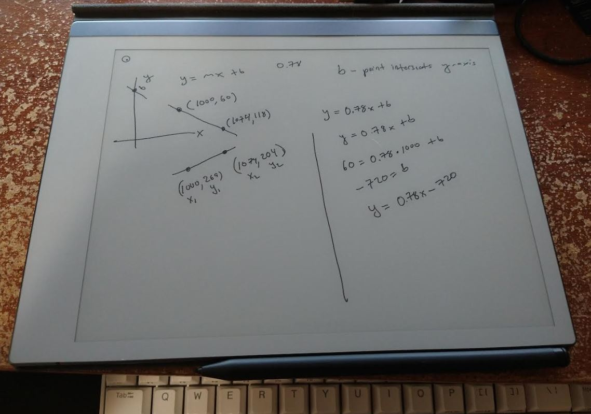

11:54 AM

Back on, kinda slept in

12:02 PM

distracted by my cat wanting to play

lol basic math

https://www.cuemath.com/geometry/y-mx-b/

ugh I gotta read through this

12:12 PM

algebra bro lol, dumbass

wolfram is so sick

so I'll generate the formula of these two lines, and then see where they intersect

alright music off to read

I used to be good at math, or at least I took AP calc in high school and took calc 3, diff eq, intro to quantum... but yeah it's all gone...

10 years later damn, unused

intro to quantum was brutal, eigen values, several page solutions to a problem... f...

I was not an A+ student though, I was the B's or lower

In college after the first year I started to go downhill since you are free to do what you want and for me I wanted to party more than study

Had to retake classes, walked out on my thermo exam (fail it) I was just mad at myself

Used to be like "how will I pay down $30K of loans with no degree?" ha

Crazy... be like, Matrix "Free your mind" jumps and falls

12:32 PM

Why do I do this? Often after I get to a "done" state of a project, I'm like cool? what happens now, am I rich? no, was it successful then? idk

but there is the fun in chasing the solution, being in the moment, working on it, even if at the end, the end result is junk

alright I'm going to read this tutorial now

https://www.calcunation.com/calculator/slope-intercept.php

that one is good, I can see how it works and it explains below how to use it

The bit I was missing after finding the slope (m) is using one of the points to find b

"slope intercept form"

the photo having y0 at the top-left is confusing too slope wise

a downward slope is technically positive or if referencing 0, positive (flipped)

12:44 PM

okay so now I have the slope

gotta find a point (x,y) that satisfies both linear expressions

according to this

https://owlcation.com/stem/Math-How-to-Find-the-Intersection-of-Lines

oh this is easy just set them equal to each other

I think I can start writing code

I gotta catch this flipped axis early

I need to take more images to see where the red x is

Awe what a sweet boy doing his homework

12:56 PM

I am going slow... this feels like drudging through work

I want to work on some personal life tools soon but haven't produced any material on this or the twerk lidar robot projects in a bit...

I also need to dive into oscope/fpga stuff still and the 50CT project

1:03 PM

ooh man I'm sad again, was reminded of Edgerunners

noooooooooooooooooooooooooooooo, tragic

I'm distracted looking at social media

1:06 PM

this is interesting, I wouldn't return a formula string right

return parts of it

I'll use negative numbers, so y goes from 0 at the top so down is negative

1138, 168 is the answer we want

1:22 PM

first run is not working, wrong answer

1:25 PM

manually doing the equation I get

1126.51 for an x value

which is off, it's "close enough" but errors add up

it's off by about 1%

2:13 PM

recorded a video/making it to publish

3:11 PM

ooh 90 minute processing times

I can understand... free bandwidth/YT just eats your videos

My stuff doesn't get a lot of views so understandable

I'll finish this, then I'll chill today.

I have some other things I need to do that are for personal peace of mind (finance related).

3:20 PM

I'm definitely getting super distracted, going to finish this intercept

3:26 PM

omg cannot focus, reeeeeeeeeeeeeeeeee

the numbers are correct, the calculation is wrong somehow

3:33 PM

alright let me do this, then I'll just chill

kind of a disappointing day productivity, I think due to me producing that video, it's an ego satisfaction even though I technically have not achieved anything other than this formula

1126, -155 (155) vs, 1138, 168

1%, 8% off damn, not great

yeah... that's not great the accuracy

I wonder why it's so off

Let me try another set, it could be the pixels are not exact lines, due to the staggering for diagonal

1039, 91  to 1109, 146

1039, 241 to 1109, 190

something not addressed yet is the inner/outer edges of the red lines

this time got

1132, 169

that's better

