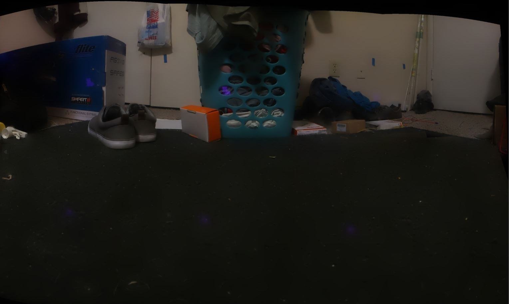

1:55 PM

slow start today, just doing some finace balancing stuff

going to read up on this

https://docs.opencv.org/3.4/d1/db7/tutorial_py_histogram_begins.html

I'm the type of person that always has background noise going

probably how I'm able to live alone for so long/years

if I need to focus though, I'll turn my music off

2:00 PM

alright starting

range 0-255 of pixel value, 0 dark, 255 bright

BINS = histSize

HSV

https://en.wikipedia.org/wiki/HSL_and_HSV

https://www.educba.com/opencv-hsv-range/

H [0,179]
S [0,255]
V [0,255]

My concern is do I need to specifically change V or can I just use the full available range

You can see in the image I'm working with above, there are purple patches from the TFmini-S single point lidar, so I should already know how far away some things area... I could make the pano process even more complicated by knowing where that patch is in general on a photo taken by the camera and finding its center/keeping it... but that'd be problematic

I can just use fixed geometry (pan/tilt) observation/offset

### histogram 1d

so when I run this, I have a range of [0, 118]

I need to see these values not as a plot

oh okay I got it, so the counts is the Y value, bins is the x value 0-255 paired

2:32 PM

sucking already at a basic algo, find min max of array

okay need to read on 2d histogram again

2:38 PM

crap... gotta work on something else

5:53 PM

well I got sucked into a bug fix on an old project I worked on
