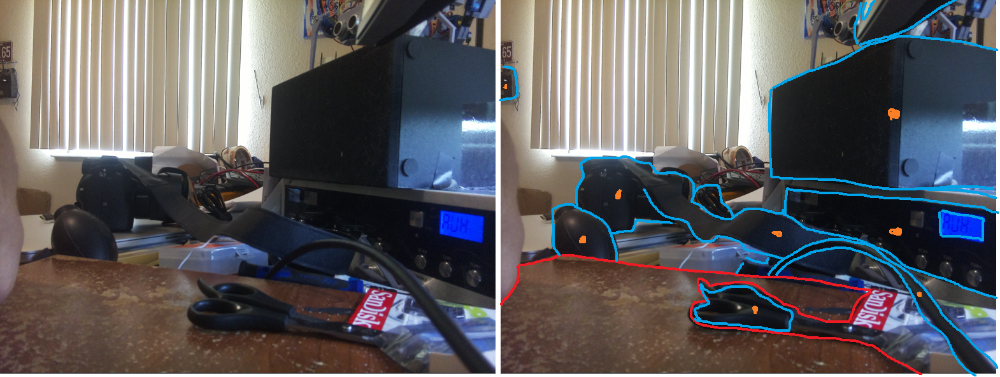

### Navigation plan

What I'm attempting to do is called "image segmentation". The process goes like this:

- take photo
- do image segmentation to get blobs
- depth sample the centroid(s) of the blobs
- then this becomes a depth map for the robot to decide what to do with

Advanced

- apply bounding boxes to the items for visual eg. web telemetry
- for recognition even at different angles (hard)

I will also record the images/decisions by the robot and if it fails (runs into something) then I'll see what it did and why it failed.